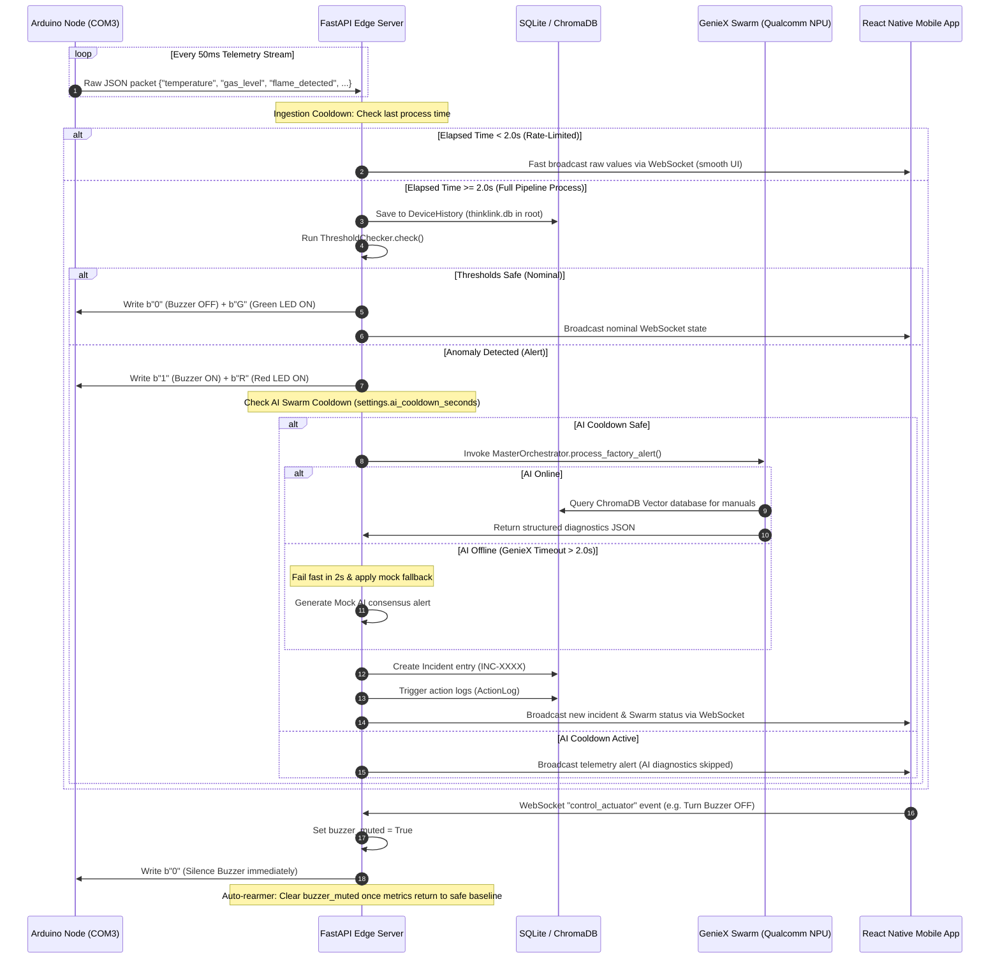

# ThinkLink — Snapdragon Edge Industrial Safety Monitor

> **Hackathon Project** — Built for the Qualcomm Snapdragon AI PC Hackathon. An offline-first, real-time safety sentinel leveraging edge intelligence, physical hardware integration, and multi-modal AI diagnostics.

---

## 📌 1. Problem Statement & The Solution

### 1.1 The Problem
In modern industrial facilities (such as semiconductor fabrication plants and automated manufacturing lines), safety-critical events like chemical leaks, electrical overheating, and fires require split-second responses. Traditional setups suffer from three fatal flaws:
1. **Cloud Dependency:** Safety systems relying on cloud APIs fail when local internet connectivity drops, introducing high latency and severe safety hazards.
2. **Siloed Diagnostics:** Sensor telemetry, voice operator logs, and visual inspection cameras operate in isolation, lacking a unified diagnostic system.
3. **Slow Alerting Chains:** Traditional RAG systems or LLM orchestrations introduce heavy inference delays, which are unsafe for immediate hardware cutoff needs (e.g. fire/flame suppression).

### 1.2 The Solution: ThinkLink
ThinkLink is an **offline-first, real-time edge security sentinel** that acts as a bridge between physical hardware, edge computing, and multi-modal AI:
* **Instant Fail-Safe Cutoff:** Local threshold checks run directly on the edge server to actuate physical buzzers, warning LEDs, and safety cutoff relays in under **50ms**.
* **Offline-First local Swarm:** A multi-agent AI Swarm runs completely locally on the **Snapdragon NPU** (via GenieX) using localized RAG (ChromaDB) to diagnose root causes and output checklists to field engineers.
* **Instant Local Notifications:** Real-time push notifications stream directly to the operator's mobile device over a local Wi-Fi WebSocket network, completely bypassing external cloud services.

---

## 👥 2. Role-Based Engineering Ownership

To succeed in a rapid development cycle, the engineering duties were split into four core disciplines:

### 2.1 Hardware Engineer (IoT & Fail-Safe Actuators)
* **Components Owned**: Arduino UNO edge firmware, physical piezoceramic buzzers, 5V single-channel isolation relays, status LED indicators (Red warning, Green nominal).
* **Core Tasks**:
  * Programmed the microcontroller serial transmitter to stream JSON telemetry packets (`{"temperature", "gas_level", "flame_detected", "vibration", ...}`) over USB Serial (9600 baud, COM3).
  * Wired the safety barrier and emergency cutoff inputs using a **Normally Closed (NC)** loop (outputting `1` when safe, `0` when tripped) for robust fail-safe operations.
  * Configured serial command listeners to parse incoming single-character bytes (`"1"`, `"0"`, `"R"`, `"G"`, `"2"`, `"3"`) to toggle outputs in real-time.

### 2.2 Backend Engineer (Edge Server & Data Pipelines)
* **Components Owned**: FastAPI Python edge server, SQLite database system (SQLAlchemy ORM models), WebSocket manager connection pool, telemetry pipeline coordinator.
* **Core Tasks**:
  * Built the **Telemetry Ingest Pipeline** executing device status audits, rolling history writes, threshold inspections, and client WebSocket notifications.
  * Designed the **2.0-second rate-limiting cooldown** at the serial stream parser and REST endpoints to prevent SQLite database writes from locking under high frequency.
  * Created the `POST /database/clear` REST route to wipe logs safely and relocated the database file outside the Uvicorn reload path to prevent infinite server restarts.

### 2.3 AI Engineer (Edge LLMs & Vector Databases)
* **Components Owned**: `MasterOrchestrator` routing agent, Faster-Whisper audio transcription model, BLIP captioning model, ChromaDB knowledge bases, GenieX Snapdragon NPU API connection.
* **Core Tasks**:
  * Configured local **Faster-Whisper** with factory-specific vocabulary (e.g. *PACVD, RIE*) and local **BLIP** to caption equipment cracks and defects.
  * Populated a custom **ChromaDB vector store** with semiconductor safety instructions for Lithography, Deposition, Quality, and Packaging domains.
  * Configured a **2.0-second request timeout** and mock warning consensus fallback to keep the backend fluid if the local NPU server was busy or offline.

### 2.4 Frontend Engineer (Operator Mobile App)
* **Components Owned**: Expo React Native mobile client, WebSocket telemetry context listener, UI Dashboard screens.
* **Core Tasks**:
  * Programmed real-time circular and linear telemetry gauges displaying temperature, gas levels, flame intensity, and vibration.
  * Integrated local push notifications (`expo-notifications`) triggering instant alarm sounds and vibration patterns when flame alerts are broadcast.
  * Created the Controls Screen remote actuators toggles, paired status check dots (PC, Arduino, Smart Glasses link status), and Settings pairing configuration fields.

---

## 🏗️ 3. "Multiverse" Distributed Swarm Architecture

ThinkLink functions as a **Unified Multiverse of Interconnected Edge Nodes** collaborating in real-time:

```
       ┌────────────────────────────────────────────────────────┐
       │             React Native (Expo Mobile App)             │  ◄─── COGNITIVE VIEW
       │    [Live Dashboard]  [Remotes]  [Settings / DB Wipe]   │       (Operator Portal)
       └───────────────────────────▲────────────────────────────┘
                                   │  WebSocket Data Push
                                   │  & JSON REST API
       ┌───────────────────────────▼────────────────────────┐
       │             Snapdragon AI PC (FastAPI)             │  ◄─── BRAIN / SWARM NODE
       │   ┌────────────────────────────────────────────┐   │       (Local CPU & NPU)
       │   │  Local Multimodal Swarm (GenieX Qwen3)     │   │
       │   │  [Input Agent] -> [Supervisor] -> [RAG]    │   │
       │   └─────────────────────▲──────────────────────┘   │
       │                         │ Database Read/Write      │
       │   ┌─────────────────────▼──────────────────────┐   │
       │   │  ChromaDB Manuals  & SQLite Incident Log   │   │
       │   └────────────────────────────────────────────┘   │
       └───────────────────────────▲────────────────────────┘
                                   │  USB Serial Communication
                                   │  (Actuator Writes & Ingest)
       ┌───────────────────────────▼────────────────────────┐
       │                Physical Edge Node                  │  ◄─── PHYSICAL INTERACTION
       │     [Arduino UNO]  [Buzzer]  [Relay]  [LEDs]       │       (Fail-Safe Loop)
       └────────────────────────────────────────────────────┘
```

The system splits responsibilities into three distinct, specialized "verses":
1. **The Physical Verse (Arduino Edge Node):** The interface with real-world hazards. Operates locally with analog sensors and hardware switches to actuate sirens and power cutoffs.
2. **The Cognitive Swarm Verse (Snapdragon AI PC Backend):** The decision center. Contains the RAG knowledge models, AI supervisor nodes, and logs database.
3. **The Human Verse (Operator Companion Client):** The visualizer and manual control node. Receives real-time sensor streams and local push notifications, granting field engineers control over hardware overrides.

---

## ⚡ 4. Qualcomm Snapdragon Technologies Used

ThinkLink runs **fully offline** on the **Qualcomm Snapdragon AI PC**, utilizing the local System-on-Chip (SoC) capabilities:
* **GenieX Execution Layer:** Connects the FastAPI Python backend to the local hardware, enabling the Snapdragon CPU & NPU to run LLMs and VLMs locally.
* **Snapdragon NPU Acceleration:** Accelerates local neural network inference times. It runs:
  * **Qwen3-8B-Instruct** for master agent orchestrations and safety manuals text RAG search.
  * **Qwen3-VL-4B-Instruct** for multimodal image/vision analysis (inspecting visual alerts like machinery cracks, fire feeds, and equipment statuses).
* **Local Offline ASR/VLM:** Local execution of Faster-Whisper and BLIP captioning models directly on the AI PC, safeguarding data privacy and ensuring low latencies.

---

## 📊 5. Performance Metrics

Thanks to local edge orchestration, ThinkLink delivers sub-second response times:

| Pipeline Step | Latency (Local NPU/PC) | Mechanism |
|---|---|---|
| **IoT Telemetry Ingestion** | **< 10ms** | USB Serial polling @ 9600 baud |
| **Immediate Fail-Safe Cutoff** | **< 50ms** | local threshold checker → Serial write |
| **WebSocket UI Refresh** | **~15ms** | Non-blocking `asyncio` client broadcast |
| **SQLite Incident Database Log** | **< 5ms** | SQLAlchemy optimized write operations |
| **NPU Swarm AI Diagnostics** | **1.2s - 1.8s** | Qwen3 accelerated locally on Snapdragon NPU |
| **Local Push Notification Trigger** | **< 200ms** | Offline Wi-Fi WebSocket trigger to Expo client |

---

## 🔌 6. Sensor Grid & Actuators

ThinkLink uses a synchronized grid of sensors and actuators to monitor the factory floor:

### 6.1 Sensors Used
1. **KY-026 IR Flame Sensor (Dual D0 + A0):** 
   - *Use-case:* Detects fire hazards by monitoring infrared light emissions. D0 pin triggers an instant cutoff, while A0 averages analog inputs to calculate flame intensity and proximity (0.0 - 1.0).
2. **MQ-2 Gas / Smoke Sensor:**
   - *Use-case:* Monitors combustible gas leakages (e.g. LPG, Propane) and smoke density in PPM. Sets the `smoke_detected` flag if thresholds are breached.
3. **KY-028 Temperature & Humidity Sensor:**
   - *Use-case:* Measures ambient thermal levels and relative humidity, detecting boiler overheating or cooling tower failure.
4. **KY-37 Vibration Sensor:**
   - *Use-case:* Calculates machine vibration. Used to determine mechanical abnormalities, bearing wear, or structural faults.

### 6.2 Actuators Controlled
1. **Warning Siren (Piezo Buzzer):** Emits a loud audio warning to clear the floor.
2. **Status LEDs:** Displays green (nominal) or red (critical alarm) system health.
3. **Isolation Relay:** Opens standard NC circuits to cut power to heavy machinery.

---

## 🔄 7. System Workflow



---

## ⚙️ 8. Environment Setup & Configuration

Configure safety thresholds and AI connection strings in `backend/.env`:

```env
# Database
DATABASE_URL=sqlite:///../thinklink.db
database_url=sqlite:///../thinklink.db

# AI Service Settings
AI_SERVICE_URL=http://localhost:18181/v1/chat/completions
ai_cooldown_seconds=60

# Safety Thresholds
TEMP_THRESHOLD=100.0             # High Temperature Alarm Limit (°C)
GAS_THRESHOLD=500.0             # Hazardous Gas Limit (PPM)
HUMIDITY_THRESHOLD=90.0         # Upper Humidity Limit (%)
BATTERY_THRESHOLD=15            # Low Battery Alert Limit (%)
```

---

## 🚀 9. Quick Start & Installation

### 9.1 Ingest Node Setup
```bash
cd backend
python -m venv venv
venv\Scripts\activate
pip install -r requirements.txt
cp .env.example .env
```

### 9.2 Start Backend Services
Ensure your local GenieX server is running on port `18181`. Then start the FastAPI edge server:
```bash
python -m uvicorn app.main:app --host 0.0.0.0 --port 8000 --reload
```

### 9.3 Start Frontend Client
```bash
cd frontend
npm install
npm run start
```
Scan the QR code with your mobile device on the **Expo Go** application.

### 9.4 Running the Sensor Simulator
If you do not have the physical Arduino board connected to `COM3`, you can stream simulated sensor values (including nominal baselines, overheating spikes, and fire flame alarms) via HTTP POST:
```bash
cd backend
python simulate_sensors.py
```

### 9.5 Pairing Mobile App with Host PC
1. Connect both the host PC and the mobile phone to the **same Wi-Fi network**.
2. Run `python get_ip.py` in the backend folder to find your PC's LAN IP address.
3. Open the **Settings Screen** in the mobile app, type the IP into the API Base URL input, and click save. The connection status indicators will instantly turn green.
