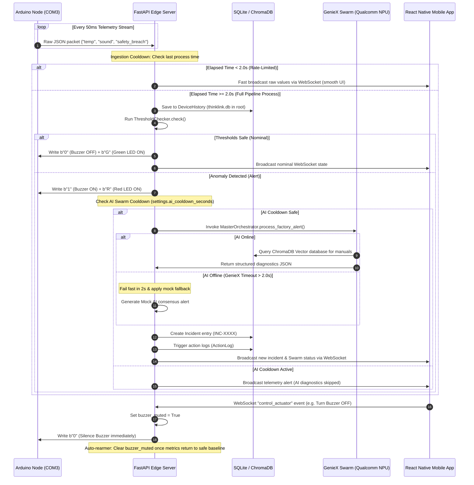

# ThinkLink — Snapdragon Edge Industrial Safety Monitor

> **Hackathon Project** — Built for the Qualcomm Snapdragon AI PC Hackathon. An offline-first, real-time safety sentinel leveraging edge intelligence, physical hardware integration, and multi-modal AI diagnostics.

---

## 👥 Role-Based Engineering Ownership

To succeed in a rapid development cycle, the engineering duties were split into four core disciplines:

### 1. Hardware Engineer (IoT & Fail-Safe Actuators)
* **Components Owned**: Arduino UNO edge firmware, physical piezoceramic buzzers, 5V single-channel isolation relays, status LED indicators (Red warning, Green nominal).
* **Core Tasks**:
  * Programmed the microcontroller serial transmitter to stream JSON telemetry packets (`{"temperature", "sound", "flame_detected", "safety_breach"}`) over USB Serial (9600 baud, COM3).
  * Wired the safety barrier and emergency cutoff inputs using a **Normally Closed (NC)** loop (outputting `1` when safe, `0` when tripped) for robust fail-safe operations.
  * Configured serial command listeners to parse incoming single-character bytes (`"1"`, `"0"`, `"R"`, `"G"`, `"2"`, `"3"`) to toggle outputs in real-time.

### 2. Backend Engineer (Edge Server & Data Pipelines)
* **Components Owned**: FastAPI Python edge server, SQLite database system (SQLAlchemy ORM models), WebSocket manager connection pool, telemetry pipeline coordinator.
* **Core Tasks**:
  * Built the **Telemetry Ingest Pipeline** executing device status audits, rolling history writes, threshold inspections, and client WebSocket notifications.
  * Designed the **2.0-second rate-limiting cooldown** at the serial stream parser and REST endpoints to prevent SQLite database writes from locking under high frequency.
  * Relocated the database file outside the Uvicorn reload path to prevent infinite server restarts.
  * Created the `POST /database/clear` REST route to wipe logs safely.

### 3. AI Engineer (Edge LLMs & Vector Databases)
* **Components Owned**: `MasterOrchestrator` routing agent, Faster-Whisper audio transcription model, BLIP captioning model, ChromaDB knowledge bases, GenieX Snapdragon NPU API connection.
* **Core Tasks**:
  * Configured local **Faster-Whisper** with factory-specific vocabulary (e.g. *PACVD, RIE*) and local **BLIP** to caption equipment cracks and defects.
  * Populated a custom **ChromaDB vector store** with semiconductor safety instructions for Lithography, Deposition, Quality, and Packaging domains.
  * Built domain classification keyword matrices and few-shot classification prompts.
  * Configured a **2.0-second request timeout** and mock warning consensus fallback to keep the backend fluid if the local NPU server was busy or offline.

### 4. Frontend Engineer (Operator Mobile App)
* **Components Owned**: Expo React Native mobile client, WebSocket telemetry context listener, UI Dashboard screens.
* **Core Tasks**:
  * Programmed real-time circular and linear telemetry gauges displaying temperature, gas levels, and vibration.
  * Integrated an animated line chart rendering the last 20 seconds of sensor trends.
  * Created the Controls Screen remote actuators toggles, paired status check dots (PC, Arduino, Smart Glasses link status), and Settings pairing configuration fields.
  * Implemented danger card UI database cleansers with double-confirmation popups and tactile haptics.

---

## 🏗️ System Architecture

The ThinkLink system is built as a stack of three decoupled layers: the Physical IoT edge, the Snapdragon AI PC local backend, and the React Native operator interface.

```
       ┌────────────────────────────────────────────────────────┐
       │             React Native (Expo Mobile App)             │  ◄─── USER INTERFACE
       │    [Live Dashboard]  [Remotes]  [Settings / DB Wipe]   │
       └───────────────────────────▲────────────────────────────┘
                                   │  WebSocket Data Push
                                   │  & JSON REST API
       ┌───────────────────────────▼────────────────────────┐
       │             Snapdragon AI PC (FastAPI)             │  ◄─── EDGE ORCHESTRATION
       │   ┌────────────────────────────────────────────┐   │       (Local CPU & NPU)
       │   │  Local Multimodal Swarm (GenieX Qwen3)     │   │
       │   │  [Input Agent] -> [Supervisor] -> [RAG]    │   │
       │   └─────────────────────▲──────────────────────┘   │
       │                         │ Database Read/Write      │
       │   ┌─────────────────────▼──────────────────────┐   │
       │   │  ChromaDB Manuals  & SQLite Incident Log   │   │
       │   └────────────────────────────────────────────┘   │
       └───────────────────────────▲────────────────────────┘
                                   │  USB Serial Communication
                                   │  (Actuator Writes & Ingest)
       ┌───────────────────────────▼────────────────────────┐
       │                Physical Edge Node                  │  ◄─── IOT HARDWARE
       │     [Arduino UNO]  [Buzzer]  [Relay]  [LEDs]       │       (Fail-Safe Loop)
       └────────────────────────────────────────────────────┘
```

---

## 🔄 System Workflow & Sensor Fusion



---

## 🛠️ Workflows Deep Dive

### 1. Telemetry Ingestion Throttling (2.0s Cooldown)
* **Ingest Control**: The background thread `read_serial_data_sync` parses incoming JSON telemetry lines from the serial port at a 50ms polling interval.
* **Pipeline Throttling**: To avoid overloading the SQLite database and writing repetitive logs, a **2.0-second cooldown** per device is enforced.
* **WebSocket Bypass**: When a packet is rate-limited, the server skips database writes and AI routing but still broadcasts the telemetry to all WebSockets. This keeps the mobile dashboard charts updating smoothly and live.

### 2. Fail-Safe Normally Closed (NC) Safety Breach Logic
* **Industrial Standard**: Safety barrier and emergency stop switch inputs on the Arduino are configured using a **Normally Closed (NC)** circuit design.
* **Logic mapping**: 
  * `safety_breach: 1` = Loop closed (Safe/Nominal operation).
  * `safety_breach: 0` = Loop broken (Barrier tripped, emergency stop pressed, or wire disconnected).
* **Alert Trigger**: In [main.py](file:///c:/THINKLINK/THINKLINK/backend/app/main.py#L187), the backend evaluates `data_dict.get("safety_breach", 1) == 0`. When it detects a breach (`0`), it sound-triggers the alarm immediately.

### 3. Remote Actuator Overrides & Auto-Rearming
* **Manual Mute**: If the buzzer is blaring due to an active breach, users can click the "Local Buzzer Alarm" switch in the app's Controls screen. The backend intercepts this event, sets `buzzer_muted = True`, and writes `b"0"` to the Arduino serial port to silence the physical alarm while keeping the warning LED red.
* **Auto-Rearm**: Once the anomaly is resolved and sensor readings return to safe baseline thresholds, the system resets `buzzer_muted = False`. This ensures that subsequent emergencies will correctly sound the alarm again.
* **Isolation Relay**: Provides a high-risk remote actuation switch on the mobile client. Activating the switch sends `b"2"` (Shutdown equipment) and turning it off sends `b"3"` (Restore power) over the serial bus.

### 4. Fail-Fast 2s AI Server Fallback
* **Low-Latency Checks**: Requests sent to the local Qualcomm NPU Qwen3-8B brain via GenieX are capped at a **2.0-second timeout** in [master_orchestrator.py](file:///c:/THINKLINK/THINKLINK/backend/app/agents/master_orchestrator.py#L102).
* **Mock Consensus Fallback**: If the NPU server is loading models or offline, the Swarm diagnostic step returns a mock consensus alert string (`"CRITICAL ALERT: Smoke detected. Mock AI override active."`) and routes the incident to the `QUALITY` domain expert, ensuring server execution doesn't block.

### 5. Double-Confirmation Database Wipe
* **Safe Cleans**: Exposed via `POST /database/clear` in [database.py](file:///c:/THINKLINK/THINKLINK/backend/app/api/routes/database.py). It safely clears tables in order to respect database relationships.
* **UI Confirmation**: Placed on the Settings Screen under a separate red card. It requires a double-step confirmation prompt and uses tactile haptic feedback to prevent accidental deletions.

---

## 📱 5. Mobile App Layout & Screen Flows

The mobile client is built in React Native (Expo) and features four primary screens:

### 5.1 Dashboard Screen
* **Live Sensors Gauge**: Circular and linear gauges tracking temperature, humidity, gas concentration (PPM), and vibration index in real-time via the WebSocket connection.
* **Rolling History Chart**: An animated line chart mapping the last 20 readings to visual curves, illustrating trend directions.
* **Active Incident Warning Banner**: Appears dynamically at the top of the dashboard when a breach is active, displaying severities, departments, and quick-resolve buttons.

### 5.2 Controls Screen (Manual Remotes)
* **Actuators Switches**: Remote toggles for the Local Buzzer, Safety LED, and Emergency Isolation Relay.
* **Device Pairing Monitor**: Lists connection status indicators for:
  * **FastAPI Server (PC)**: Green if paired.
  * **Arduino Ingest**: Green if serial handshake active.
  * **Smart Safety Glasses**: Green if camera/glasses feed linked.
* **Diagnostics trigger**: Features a `Run System Health Check` button to audit all SQLite log files directly from the edge.

### 5.3 Incidents Log Screen
* **Historical Audit log**: Displays a filterable list of all incidents logged.
* **RAG Diagnostic Details**: Allows clicking an incident card to view details:
  * Department routed to (Lithography, Deposition, Quality, Packaging).
  * Exact reasoning text derived from vector procedures.
  * Recommended checklist actions recommended by domain experts.

### 5.4 Settings Screen
* **IP Pairing Input**: Text fields to enter the host PC's Wi-Fi IP address (e.g. `192.168.1.100`) discovered using `get_ip.py`.
* **Danger Zone (Wipe Database)**: Card containing a double-confirmation mechanism with alerts and haptic triggers to execute `POST /database/clear`.

---

## 📁 6. Repository Structure

```
THINKLINK/
├── thinklink.db                # RELOCATED SQLite Database (Prevents Uvicorn reload loop)
├── send_test_data.py           # Scenario test script (Nominal -> Spikes -> Safety breach)
├── backend/                    # FastAPI python edge server
│   ├── app/                    # Code root
│   │   ├── agents/             # MasterOrchestrator, input parser, Supervisor AI
│   │   ├── api/                # REST Routers & DB wipe endpoints
│   │   ├── core/               # Configuration settings loaders
│   │   ├── database/           # SQLite connection pools and models
│   │   └── services/           # Telemetry pipelines, websocket managers, action executors
│   └── simulate_sensors.py     # Real-time HTTP sensor simulator
└── frontend/                   # Expo React Native mobile application
    ├── src/                    # Code root
    │   ├── context/            # TelemetryContext WebSocket client
    │   ├── screens/            # DashboardScreen, ControlsScreen, SettingsScreen
    │   └── services/           # Api client helper calls
    └── package.json            # React Native app specifications
```

---

## ⚙️ 7. Environment Configuration

Configure safety thresholds and AI connection strings in `backend/.env`:

```env
# Database
DATABASE_URL=sqlite:///../thinklink.db
database_url=sqlite:///../thinklink.db

# AI Service Settings
AI_SERVICE_URL=http://localhost:18181/v1/chat/completions
ai_cooldown_seconds=60

# Safety Thresholds
TEMP_THRESHOLD=100.0             # High Temperature Alarm Limit (°C)
GAS_THRESHOLD=500.0             # Hazardous Gas Limit (PPM)
HUMIDITY_THRESHOLD=90.0         # Upper Humidity Limit (%)
BATTERY_THRESHOLD=15            # Low Battery Alert Limit (%)
```

---

## 🚀 8. Quick Start & Pairing Guide

### 8.1 Ingest Node Setup
```bash
cd backend
python -m venv venv
venv\Scripts\activate
pip install -r requirements.txt
cp .env.example .env
```

### 8.2 Start Services
Ensure the local GenieX server is running on port `18181`. Then start the backend:
```bash
python -m uvicorn app.main:app --host 0.0.0.0 --port 8000 --reload
```

### 8.3 Start Frontend Client
```bash
cd frontend
npm install
npm run start
```
Scan the QR code with your mobile device on the **Expo Go** application. 

### 8.4 Network Pairing Process
To pair the mobile device with the host AI PC:
1. Connect both the host PC and the mobile phone to the **same Wi-Fi network**.
2. On the backend terminal, run:
   ```bash
   python get_ip.py
   ```
3. Copy the printed IP address and type it into the Settings screen on the mobile app. The WebSocket status dots will instantly turn green.
